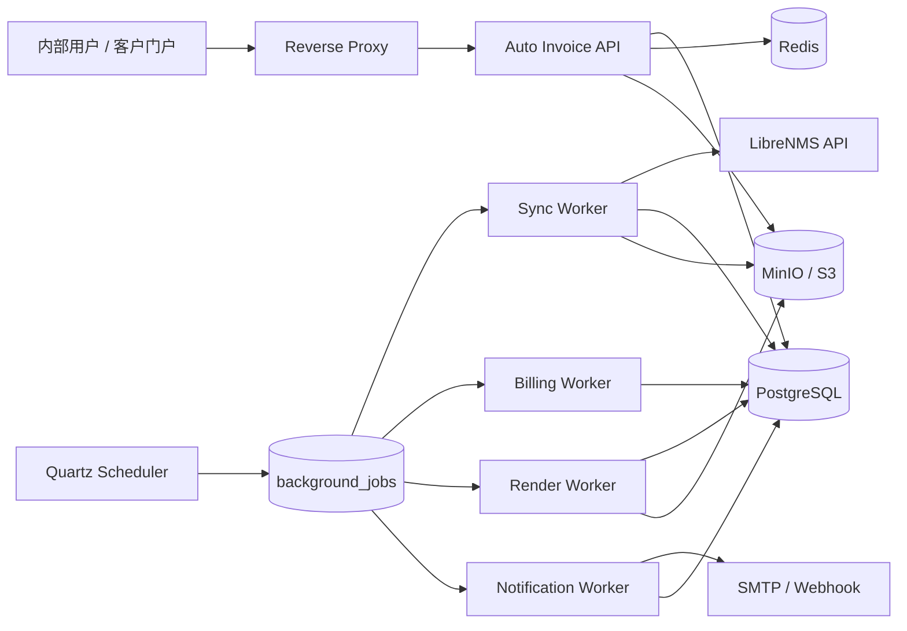

# 总体架构与部署

## 1. 架构选择

首版采用模块化单体 API 和独立 Worker。所有进程共享领域代码和 PostgreSQL，通过不同 Spring Profile 启动。

该方案保留强事务能力，减少早期分布式系统成本，同时允许同步、计算、渲染和通知按压力独立扩容。

## 2. 逻辑架构



## 3. 部署单元

| 服务 | 职责 | 事实数据 |
|---|---|---|
| `reverse-proxy` | TLS、访问控制、请求限制 | 无 |
| `auto-invoice-api` | REST、认证、后台和门户接口 | PostgreSQL |
| `auto-invoice-scheduler` | 周期触发和扫描 | Quartz 表 |
| `worker-sync` | LibreNMS 和证据归档 | PostgreSQL、对象存储 |
| `worker-billing` | 计费、批次和预览 | PostgreSQL |
| `worker-render` | 模板和 PDF | PostgreSQL、对象存储 |
| `worker-notify` | 邮件、Webhook 和提醒 | PostgreSQL |
| `postgres` | 领域数据、任务、Outbox 和审计 | 是 |
| `redis` | 缓存、限速和短期协调 | 否 |
| `minio` | 原始响应、图像、模板资源、PDF 和附件 | 是 |

## 4. 后端模块

| 模块 | 职责 |
|---|---|
| `identity` | 用户、会话、MFA、角色和权限 |
| `tenant` | 租户上下文和租户配置 |
| `customer` | 客户、公司和联系人 |
| `catalog` | 产品、业务、分组和服务资源 |
| `contract` | 合同、计费项和价格规则 |
| `usage` | LibreNMS、映射、同步和快照 |
| `billing` | 纯计费函数、分摊和计算轨迹 |
| `invoice` | 账单配置、预览、正式化、作废和更正 |
| `approval` | 工作流和审批动作 |
| `template` | 模板、版本、字段和列表配置 |
| `render` | 安全 HTML 和 PDF |
| `payment` | 付款、分配、退款和余额 |
| `notification` | 通知模板、发送和重试 |
| `platform` | 文件、编号、任务、Outbox 和审计 |

模块只能通过应用服务、领域事件或只读查询模型交互。禁止一个模块直接修改另一个模块的表。

## 5. 关键数据流

```text
Quartz 创建持久任务
  -> 同步 LibreNMS Bill History
  -> 生成不可变用量快照
  -> 选择合同计费项和价格版本
  -> 纯计费引擎输出明细和计算轨迹
  -> 创建预览和水印 PDF
  -> 业务审核
  -> 财务审核
  -> 正式化事务冻结数据并分配编号
  -> Render Worker 生成正式 PDF 和哈希
  -> Outbox 触发通知
  -> 付款分配更新付款状态
```

## 6. 一致性策略

- 领域状态和 Outbox 在同一 PostgreSQL 事务提交。
- 外部副作用使用至少一次投递，消费者按事件 ID 或业务幂等键去重。
- 正式化通过 `source_preview_id` 唯一约束防止重复。
- Worker 使用任务租约；崩溃后租约到期可被其他 Worker 续领。
- Redis 失效不能导致账单事实或任务丢失。

## 7. 故障边界

- LibreNMS 故障：禁止生成依赖缺失用量的新预览；已有快照仍可审核。
- MinIO 故障：正式账单停留 `FINALIZING`，重试时不重新编号。
- SMTP/Webhook 故障：不回滚账单，只重试通知。
- Redis 故障：缓存退化到数据库，核心账单流程继续。
- Worker 故障：任务租约过期后续领，处理器必须幂等。

## 8. 部署基线

- Linux x86_64 私有化部署。
- Docker Compose 首版，容器保持无状态以便迁移 Kubernetes。
- 数据库、Redis 和 MinIO 使用独立持久卷。
- 秘密通过 Docker Secret、KMS 或环境注入，不写入镜像和 Git。
- API、Worker 和依赖服务均提供健康检查。
- 数据库迁移使用 Flyway，应用启动不自动执行不可逆大迁移。

## 9. 技术栈

- Java 21、Spring Boot、Spring Security、Hibernate/JdbcTemplate。
- PostgreSQL 16+、Redis、Quartz、Flyway。
- MinIO/S3、Handlebars、Playwright Java、Chromium。
- Vue 3、TypeScript、Element Plus、Pinia、Vue Router、ECharts。
- OpenAPI、Testcontainers、WireMock、JUnit 5、Playwright E2E。
