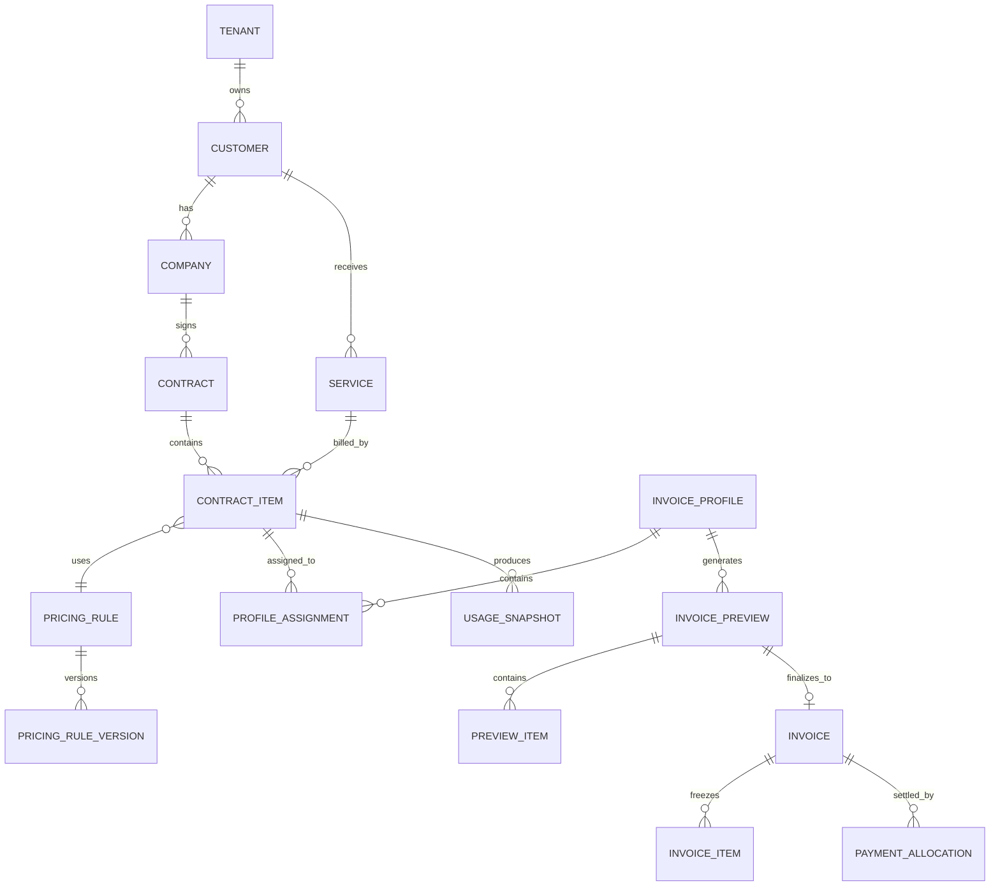

# 领域模型

## 1. 核心关系



## 2. 客户与公司

客户是账户或商业关系主体。公司是签约、付款或账单抬头主体。

- 一个客户可以有多个公司。
- 公司归属于一个客户。
- 客户和公司都可以有默认币种、语言和付款条件。
- 公司停用后不能创建新合同，但历史账单继续可查。

客户编号示例：`CUST-2026-0001`。

## 3. 联系人

联系人归属于客户，可选绑定公司。联系人类型包括业务、技术、财务和账单联系人。

收件人是否接收正式账单和提醒通过显式字段控制，不根据联系人类型自动推断。

## 4. 产品、业务和服务资源

产品是可销售标准定义，业务是客户实际开通的实例。

业务类型包括 95 带宽、固定带宽、总流量、托管、服务器、机柜、电力、IP、BGP、专线、交叉连接、安装、运维和自定义费用。

服务资源用 `resource_type + resource_ref + attributes` 表示设备、端口、IP 段、服务器、机柜、U 位、电力和线路。

业务编号示例：

```text
SVC-HK-IPT-0001
SVC-JP-SERVER-0001
SVC-IPV4-0001
```

## 5. 合同

合同包含客户、公司、有效期、账单周期、付款期限、币种、税率、附件和状态。

有效期使用 `[effective_from, effective_to)`。自动续约通过新版本或新合同记录表达，不覆盖历史日期。

合同状态：

```text
DRAFT -> PENDING_APPROVAL -> ACTIVE -> EXPIRED
                   |           |
                   v           v
                VOIDED      SUSPENDED -> TERMINATED
```

## 6. 合同计费项

合同计费项是自动出账最小单位。一项业务可以包含多个计费项，例如服务器业务同时包含：

- 托管费。
- IPv4 地址费。
- 电力费。
- 临时带宽费。

计费项保存服务、计费类型、计费周期、有效期、价格规则、默认数量、单位、税务分类、自动计费和展示设置。

## 7. 价格规则

计费项引用 `pricing_rule`。规则包含多个不可变版本，每个版本有明确有效期。

- 同一规则的已发布版本有效期不得重叠。
- 账期跨价格版本时默认拆分明细。
- 发布后的版本不能编辑，修改必须创建新版本。
- 账单明细冻结使用的版本 ID 和参数快照。

## 8. 账单配置

账单配置定义哪些计费项合并出账、使用哪个模板、抬头、币种、语言、付款账户和通知规则。

计费项关联模式：

| 模式 | 产生金额 | 可关联多个配置 |
|---|---:|---:|
| `CHARGE` | 是 | 否 |
| `ALLOCATE_PERCENT` | 是 | 是，合计 100% |
| `ALLOCATE_FIXED` | 是 | 是，不能超额 |
| `DISPLAY_ONLY` | 否 | 是 |

## 9. 用量快照

用量快照是某个计费项、账期和 LibreNMS History 的不可变证据。保存标准化指标、数据哈希、异常、原始响应文件和图像引用。

快照被正式账单引用后不能修改或删除。

## 10. 预览与正式账单

预览是可重新计算的聚合，包含系统明细、人工调整、排除项和审批实例。

正式账单是独立聚合，通过正式化事务复制和冻结预览内容。正式账单只允许变更文档状态、发送状态和付款状态，不允许修改冻结财务内容。

## 11. 付款

付款独立于账单。一笔付款可以核销多张账单，一张账单也可以由多笔付款核销。

付款状态根据有效分配和已确认退款自动计算，不能手工直接覆盖。

## 12. 聚合边界

| 聚合根 | 事务内对象 |
|---|---|
| `customer` | 公司基础关联、联系人 |
| `service` | 服务资源、标签 |
| `contract` | 计费项、附件引用 |
| `pricing_rule` | 价格版本和阶梯 |
| `invoice_profile` | 计费项归属和分摊 |
| `usage_snapshot` | 指标和证据文件引用 |
| `invoice_preview` | 明细、调整、排除、审批 |
| `invoice` | 冻结明细、文件和替代关系 |
| `payment` | 付款分配和退款信息 |
